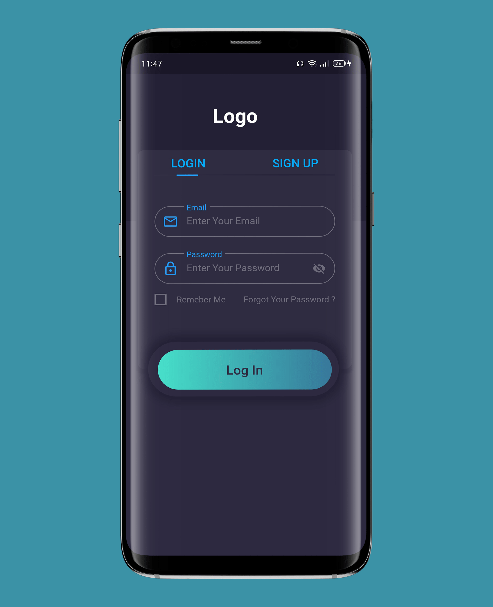
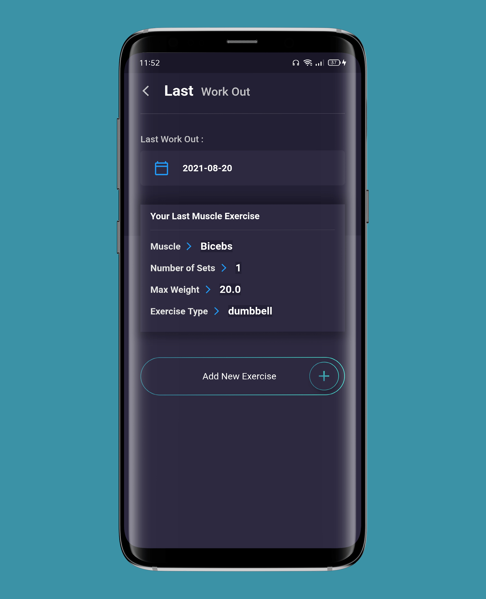

# GymApp
With this app you can track your progress easily and quickly!
You can create as many exercises as you want with the name you want!
It's your choice!

Graphics will show your progress and your body evolution and not only that 
also will show you the days in which you worked out.

# Screenshots

   
   
   
   
   
   
   
   
   
   
   
    

# Features
- Full authentication with firebase containing (Sign in, Sign up, logout).
- Save the user data when sign up or log in for the first time to keep logged in using Shared-Preferences.
- Back end validation and error handling incase of wrong inputs or technical issue.
- Updating profile info like username ,height and weight.
- Provided with chart to show your progress.
- Provided also with calender to show you the days in which you worked out.
- Gives you the information about your last work out.
- Muscle Group is provided with pictures of the muscle.
- Gives you the ability to add your own exercise.
- Add many sets as you wish.
- Can delete either the exercise you added by longPress on it or delete the exercise you played.
- A chart for each muscle to show the progress by one.
- Provider as statemanagement.

## Getting Started

This project is a starting point for a Flutter application.

A few resources to get you started if this is your first Flutter project:

- [Lab: Write your first Flutter app](https://flutter.dev/docs/get-started/codelab)
- [Cookbook: Useful Flutter samples](https://flutter.dev/docs/cookbook)

For help getting started with Flutter, view our
[online documentation](https://flutter.dev/docs), which offers tutorials,
samples, guidance on mobile development, and a full API reference.
